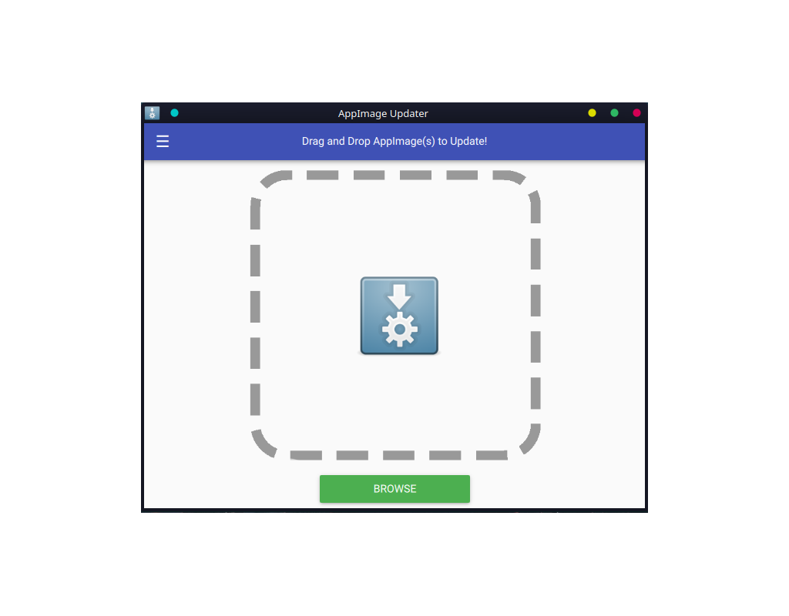

<h1 align="center">AppImage Updater</h1>

    
    
    
    
    
    

<table>
  <tr>
    <th >Download </th>
    <th >Execute</th>
  </tr>
  <tr>
    <td >
    
    </td>
    <td ><b>chmod</b> +x AppImageUpdater*-x86_64.AppImage &amp;&amp; ./AppImageUpdater*-x86_64.AppImage </td>
  </tr>
</table>

     

> :rocket: A Unofficial AppImage Updater written using AppImageUpdaterBridge , Written :black_nib: in C++ using Qt5.
> -- Antony Jr.

This is built to **Test** AppImageUpdaterBridge and also for people who like to have a nice looking AppImage Updater.

**Note** : This is not the official Update tool , this is just a example to help developers to understand **AppImageUpdaterBridge** better.
and also for people who like Qt.

Please see [AppImage Updater Bridge](https://github.com/antony-jr/AppImageUpdaterBridge) for more information.

# Support 

If you think that this project is **cool** then you can give it a :star: or :fork_and_knife: it if you want to improve it with me. I really :heart: stars though!   

You can also tweet about me on twitter , get connected with me [@antonyjr0](https://twitter.com/antonyjr0)

Thank You! :smiley_cat:

# License

The GNU Lesser General Public License V3.
Copyright (C) 2018 , Antony Jr.
